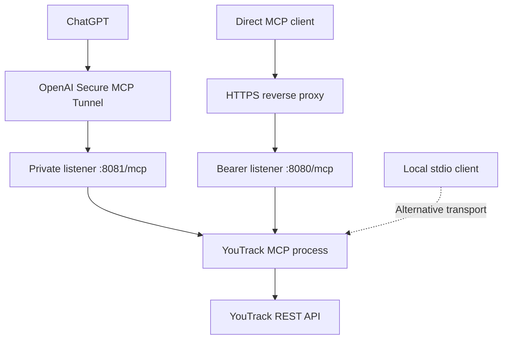

# How it works

[Documentation home](../README.md#documentation)

YouTrack MCP translates an assistant's MCP tool calls into YouTrack REST requests.
The assistant decides what to search, explain, or change; YouTrack stores the
actual issues, articles, comments, work items, and attachments.

## Connections and identity

The Compose stack runs two containers from one image: `youtrack-mcp` runs the
Rust server and `openai-tunnel` runs the tunnel client. Both HTTP listeners share
the same tools and YouTrack client. The binary can alternatively run over stdio.

The public bearer token authenticates access to the MCP, not individual YouTrack
users. Every caller uses the configured `YOUTRACK_TOKEN`. A tool's `author` filter
selects data; it does not switch credentials. The internal listener has no bearer
authentication and relies on private-network isolation.

## Startup and tool discovery

1. Read YouTrack configuration and create the REST client.
2. Fetch `<YOUTRACK_URL>/api/openapi.json`, or read `YOUTRACK_OPENAPI_PATH`.
3. Generate one typed `api_*` tool per advertised HTTP operation and register the
   17 curated workflow tools plus `api_schema`.
4. Start the selected transport. Clients initialize MCP and discover tools.

An unavailable or invalid schema prevents startup. The generated catalog follows
the connected instance's version and features; it is loaded at startup, so restart
and refresh client discovery after schema changes.

Generated tools retain input schemas in discovery. Their full output schemas are
retrieved with `api_schema`, avoiding duplication of large models in `tools/list`.
This reduces discovery payload size for infrastructure with limits such as Cosmos
DB's 2 MiB item limit; it is not a fixed cap on every possible instance's catalog.

## Curated tools and direct API access

Curated tools handle common workflows: resolving project names, discovering
custom-field types, assigning a native parent, selecting a board and sprint,
and producing a worktime report. They never create missing tags.

Generated tools expose the underlying API, including administrative and delete
operations. They do not apply the curated workflow conventions or guardrails.
Use the live input schema and, when needed, `api_schema` before calling them.
See the [tool reference](tools.md) for inputs, examples, and result formats.

## Common workflows

### Find and update an issue

Use `issue_search` with a YouTrack query, then `issue_get` for the selected issue.
Pass its readable ID to `issue_write` with `op: "update"` and the desired fields.
Omitted assignee leaves assignment unchanged; `assignee: null` clears it.
Custom fields accept `{ "name": "Priority", "value": "Critical" }` entries.

Use `issue_write.parentId` to set a native parent; an empty string clears it.
Use `link_write` for other relationships after discovering link types with `meta`.
Board and sprint names resolve within the selected board.

A curated write can perform several REST requests. These are not a transaction;
a later failure may leave earlier changes applied. Inspect the issue after a
partial failure before retrying a create or repeating side effects.

### Record and review work

Discover work-item types with `meta`, then call `workitem_write` with an issue,
date, duration in minutes, and optional description/type. `idempotent: true`
checks for an existing entry with the same issue, date, and description. It is a
duplicate check, not an atomic guarantee against concurrent calls.

Use `workitems_list` for entries and `workitems_report` for expected versus actual
time. Reports use the configured timezone, 480 minutes per weekday, configured
holidays, and 420 minutes on configured pre-holidays. The date range is inclusive.
The report fetches up to 1,000 work items; split large periods to avoid truncation.
Weekend/holiday entries contribute to summary totals but do not appear in the
working-day rows.

### Work with files

`attachment_upload` accepts a ChatGPT-authorized file object. The server downloads
the temporary URL and uploads the original bytes without image processing.
A `/mnt/data` path in an assistant environment is not a file on this server.

`attachment` lists, inspects, downloads, or deletes existing attachments. Images
up to 4 MiB are returned as MCP image content unless a target path was requested.
Other downloads are saved on the MCP server's filesystem. A returned path is not
a public download URL and is not automatically accessible to a remote client.
Signed YouTrack URLs are omitted by default; `verbose: true` includes them.

## State and persistence

There is no application database or migration step. YouTrack remains the source
of truth. Metadata caches, generated schemas, and HTTP session state live in
memory; each listener uses an in-process session manager. Reconnect after a
restart, and account for session routing before adding replicas.

Compose defines no persistent volume. Downloaded files in the container are
lost when it is replaced unless you configure a volume and download directory.
Back up business data through your YouTrack deployment's backup process.
